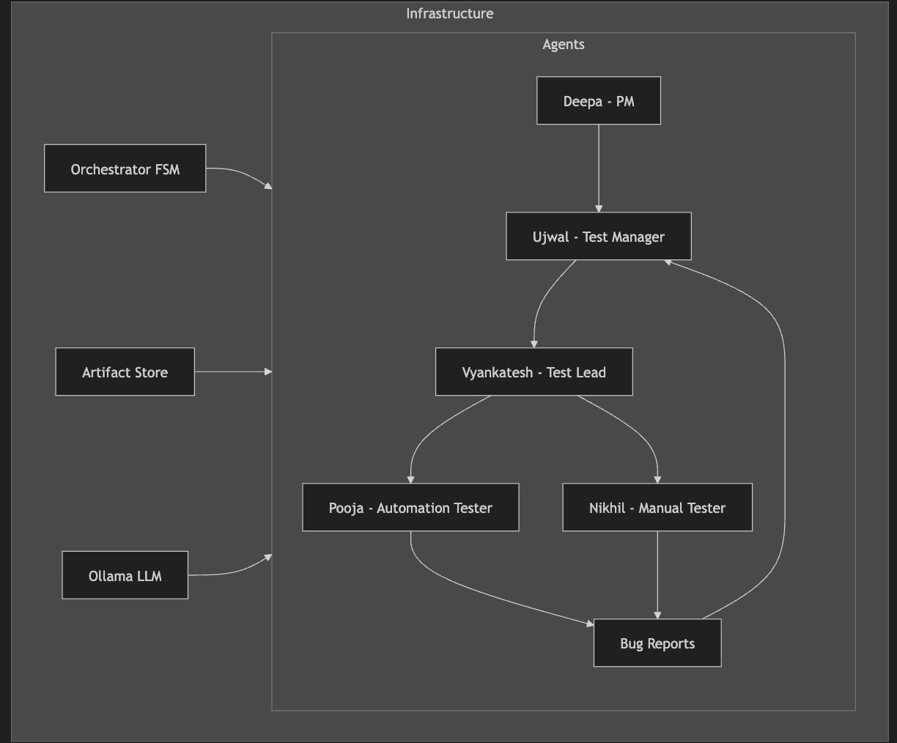

# 🤖 Multi-Agent QA System

A fully offline, autonomous multi-agent system that simulates a complete QA organization using **Ollama + Qwen** and **Python**.

## 📸 Snapshot



## 👥 The Agent Team

The system orchestrates 5 specialized AI agents working together:

1.  **Product Manager**
    - **Input**: Product Idea
    - **Output**: Market Requirements Specification (MRS) & Software Requirements (SRS)
2.  **Test Manager**
    - **Input**: SRS
    - **Output**: Test Specification (STS)
3.  **Test Lead**
    - **Input**: Test Specification
    - **Output**: Test Plan & Task Assignments
4.  **Automation QA**
    - **Input**: Test Plan
    - **Output**: Executable Python Automation Scripts (Pytest/Playwright)
5.  **Manual QA**
    - **Input**: Test Plan
    - **Output**: Manual Test Cases & Bug Reports

## 🚀 How to Run

### Prerequisites
1.  **Ollama** installed and running (`ollama serve`)
2.  **uv** installed (`pip install uv`)
3.  **Qwen model** pulled: `ollama pull qwen2.5:7b` (or `qwen3:8b`)

### Quick Start

1.  **Clone the repository**
2.  **Install dependencies**
    ```bash
    uv sync
    ```
3.  **Run the system**
    ```bash
    uv run python -m src.main "Build a secure crypto wallet app"
    ```

## 📂 Artifacts

All generated documents are saved in the `artifacts/` directory:
- `artifacts/requirements/` (MRS, SRS)
- `artifacts/testing/` (Plans, Strategies, Scripts)
- `artifacts/bugs/` (Bug reports)

## 🛠️ Tech Stack

- **LLM**: Ollama (`qwen2.5:7b`)
- **Orchestration**: Custom Python FSM
- **Environment**: `uv`
- **UI**: `rich` library for beautiful console output

## 📜 License

MIT
